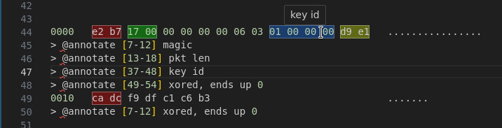
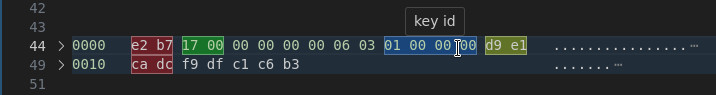
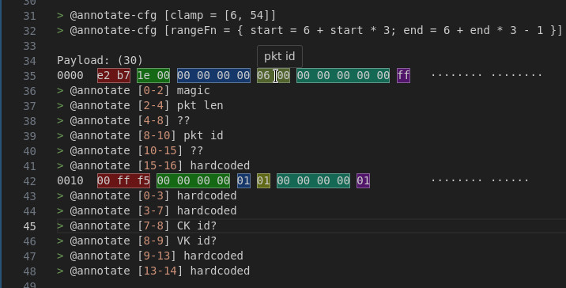
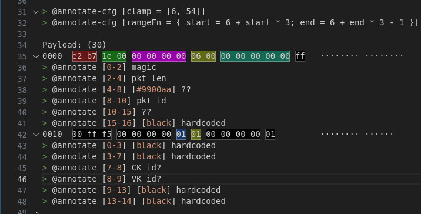

# Annotate

Parse custom `@annotate` text to colorize any text within a document.

> \> @annotate [\<start_column\> - \<end_column\>] \<text\>
> \> @annotate [\<single_column\>] \<text\>

The annotations are always contained below the annotated line, but this extension also creates fold regions for all of them.

By default, the numbers in brackets describe start/end character columns in VSCode, but with
`@annotate-cfg` directives they can be translated to anything else. In the following example, the numbers map directly to byte offsets in the packet hex dump:

The annotations are given a random color, but it can be also specified manually:

This extension also provides an "Annotate" command to quickly insert an annotation at the selected region: `annotate.annotate`.

# Annotate-cfg

The `@annotate-cfg` directives apply to any subsequent `@annotate`-s. `@annotate-cfg` can be specified multiple times in the same file so the different configurations are used with different annotations.

Currently the following configuration options can be set:

> \> @annotate-cfg [clamp = [\<start_column\>, \<end_column\>]]

- disables annotations before `<start_column>` and after `<end_column>`.

> \> @annotate-cfg [rangeFn = { start = 6 + start * 3; end = 6 + end * 3 - 1 }]

- map `start` and `end` column numbers in `@annotate` to any other value. This uses [expr-eval](https://github.com/silentmatt/expr-eval) library for safe evaluation. See the link for a list of supported operations and built-in arithmetic functions.

# Remarks

This extension was developed to simplify reverse-engineering network packet structures while still being able to write regular text remarks with maximum flexibility.
